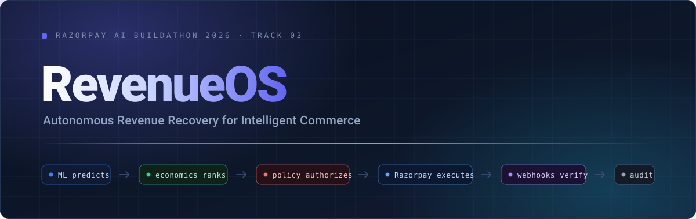
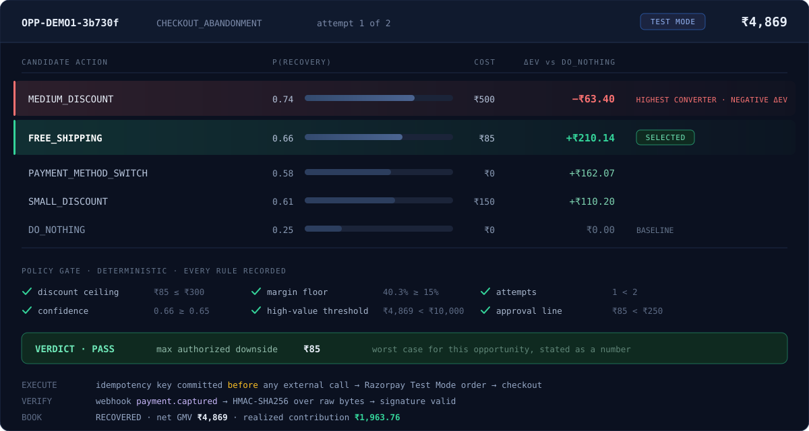
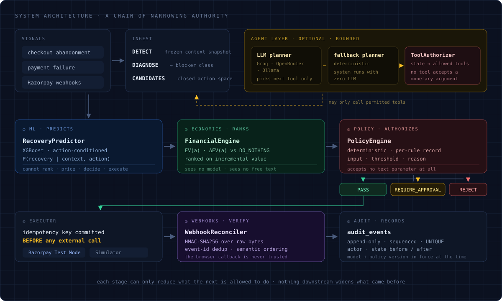
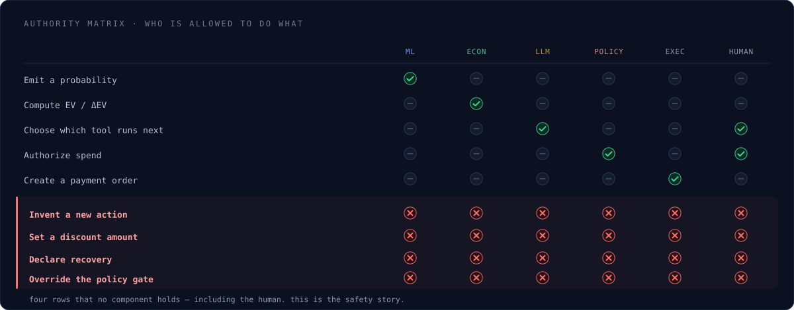
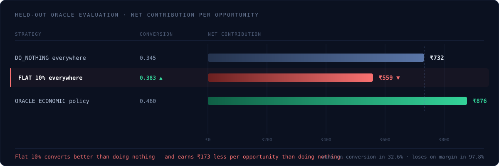
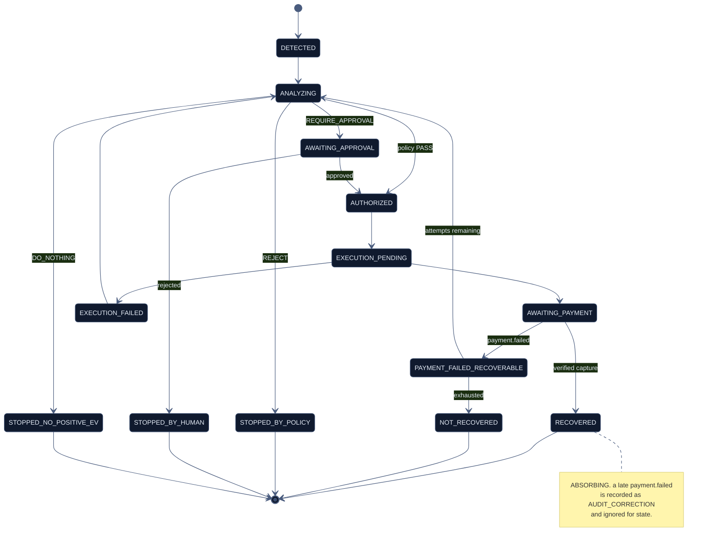
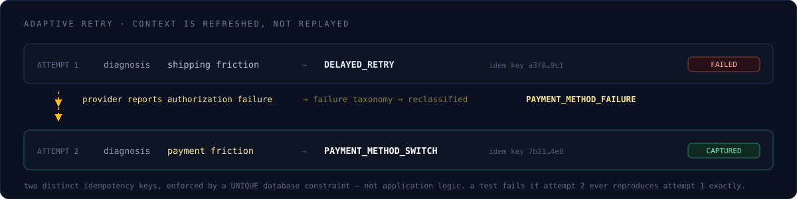
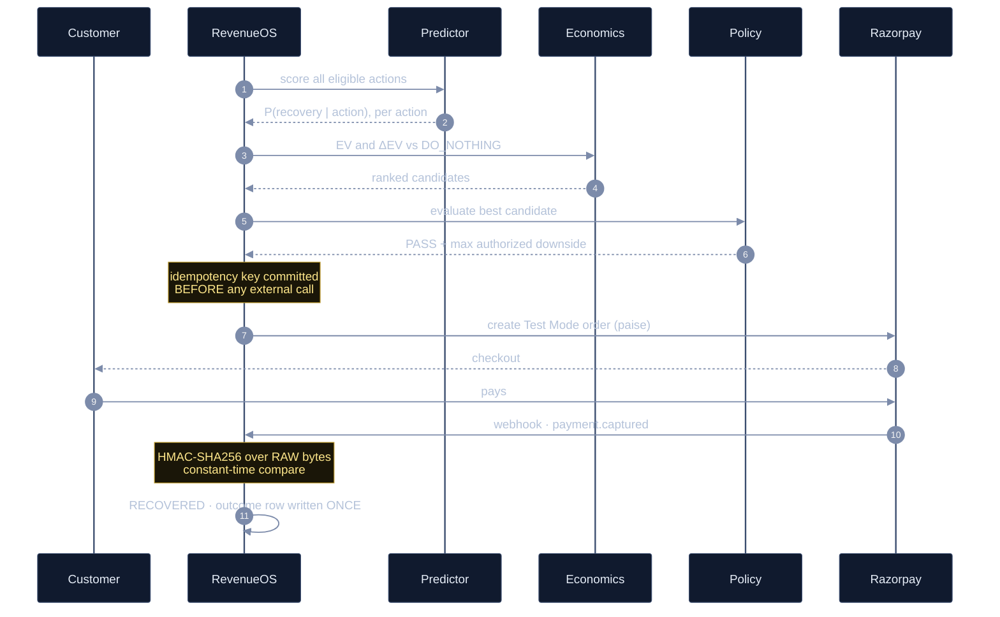
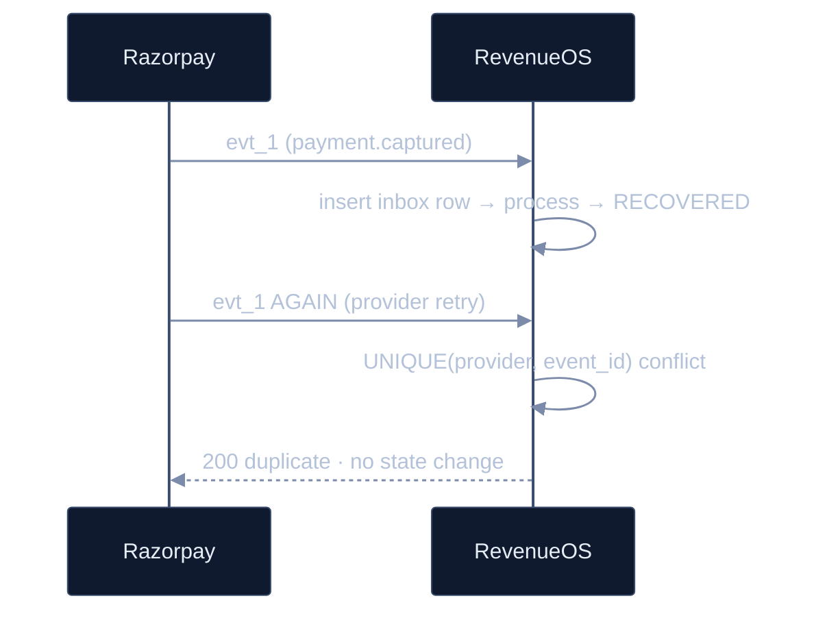

<div align="center">



<br/><br/>

[](#)
[](#)
[](#)


**[Live demo](#)&nbsp; · &nbsp;[Video](#)&nbsp; · &nbsp;[Architecture](#architecture)&nbsp; · &nbsp;[Evaluation](#evaluation)&nbsp; · &nbsp;[Demo script](#five-minutes)**

</div>

---

> Most recovery systems ask whether a transaction **can** be recovered.
>
> RevenueOS asks what caused the loss, which intervention creates the most
> **incremental contribution margin**, whether the agent is **authorized** to
> take it, and whether the money **actually arrived**.

---

<div align="center">

## The thirty-second version

</div>



The highest-converting action has **negative incremental value**. Every
conversion-optimising recovery product on the market fires it anyway.

Conversion and contribution disagree on **41.0%** of opportunities. That
divergence is the product.

---

<div align="center">

<a name="architecture"></a>

## Architecture

</div>



<br/>

<table>
<tr><th align="left">Stage</th><th align="left">Component</th><th align="left">Emits</th><th align="left">Cannot</th></tr>
<tr><td><b>predicts</b></td><td><code>RecoveryPredictor</code></td><td>P(recovery │ action)</td><td>rank · price · decide · execute</td></tr>
<tr><td><b>ranks</b></td><td><code>FinancialEngine</code></td><td>EV, ΔEV</td><td>see a model · see free text</td></tr>
<tr><td><b>authorizes</b></td><td><code>PolicyEngine</code></td><td>PASS / REJECT / APPROVAL</td><td>accept a text argument <i>at all</i></td></tr>
<tr><td><b>executes</b></td><td><code>PaymentProvider</code></td><td>order / simulated event</td><td>choose an action or amount</td></tr>
<tr><td><b>verifies</b></td><td><code>WebhookReconciler</code></td><td>verified state change</td><td>trust a browser callback</td></tr>
<tr><td><b>records</b></td><td><code>AuditRepository</code></td><td>sequenced events</td><td>be mutated or deleted</td></tr>
</table>

> [!NOTE]
> The LLM sits **outside** this chain. It may propose which tool runs next and
> write the merchant-facing explanation. It may not touch money.

---

<div align="center">

## Authority model

*The picture to put on screen when someone asks "what stops the LLM from giving a 50% discount?"*

</div>



<details>
<summary><b>Why prompt injection structurally cannot work here</b></summary>

<br/>

A customer note demanding a 50% discount changes nothing:

**①** **No 50% discount exists.** The action space is closed and enumerated in
`ml/actions.py`. No code path constructs an action from a string.

**②** **`PolicyEngine.evaluate()` accepts no text parameter.** There is no
channel through which text could reach it. A test asserts the *function
signature itself*, so the property cannot regress silently.

**③** **No agent tool accepts a monetary argument.** An unknown tool name is
treated as a hallucination, not an instruction.

The defence is structural, not a filter.

```
DO_NOTHING          FREE_SHIPPING          SMALL_DISCOUNT
MEDIUM_DISCOUNT     PAYMENT_METHOD_SWITCH  IMMEDIATE_RETRY
DELAYED_RETRY       PAYMENT_LINK           MEMBERSHIP_OFFER
HUMAN_ESCALATION
```

Ten actions, each with fixed cost, conditional incentive cost, and eligibility
predicates. Retry actions are structurally ineligible for abandonment.

</details>

---

<div align="center">

## The economics

</div>

```python
EV(a) = P(recovery | context, a)
        × ( base_contribution_margin
          − incentive_cost_if_recovered(a)     # conditional — a discount costs
          − expected_return_loss(a)            # nothing if they don't convert
          − expected_cancellation_loss(a) )
        − fixed_action_cost(a)                 # unconditional

ΔEV(a) = EV(a) − EV(DO_NOTHING)                # ranked on this, not EV
```

<table>
<tr><td width="50%" valign="top">

**Four invariants · 28 unit tests**

`①`&nbsp; incentive cost is conditional on recovery
`②`&nbsp; an incentive is subtracted exactly once
`③`&nbsp; reported GMV is net of discount
`④`&nbsp; no positive ΔEV → `DO_NOTHING` is *selected*

</td><td width="50%" valign="top">

**Where the objectives split**

| conversion-max | economics-max | |
|:---|:---|---:|
| `MEDIUM_DISCOUNT` 32.1% | `FREE_SHIPPING` | 32.8% |
| | `DO_NOTHING` | 26.0% |
| | `DELAYED_RETRY` | 15.9% |
| | `SMALL_DISCOUNT` | 13.1% |
| | `MEDIUM_DISCOUNT` | 2.2% |

</td></tr>
</table>



---

<div align="center">

## The ML layer

</div>

<table>
<tr><td width="56%" valign="top">

**What is modelled**

`P(recovery | context, action)` — action-conditioned, scored
independently for every eligible action. Not a single
"will this recover" score.

**Selected: XGBoost, no post-hoc calibration.**

Isotonic *appeared* best until the selection protocol was
corrected — it had been scored on its own fitting
partition. Under the corrected protocol, raw XGBoost has
lower ECE. Documented, not quietly patched.

</td><td width="44%" valign="top">

```
TEST ROC-AUC     ~0.60   ← modest BY DESIGN
TEST Brier        ————   ← primary metric
TEST ECE          ————   ← what decisions need
calibration       none   ← isotonic rejected,
                           reason recorded

⚠ ROC-AUC > 0.85 triggers a DEFECT
  warning, not a celebration.
```

</td></tr>
</table>

### Why low AUC is *correct* here

Decisions are expected-value comparisons, so what matters is probability
**magnitude**, not ranking. A model that ranks perfectly but is miscalibrated
produces wrong ΔEV and therefore wrong actions.

The simulator deliberately injects shared logit noise plus **hidden mechanisms
the feature set cannot observe** — bank outage windows, sale periods, courier
disruption, payday effects. High AUC would mean the environment is too easy or
something leaked.

The headline ML figure is not AUC. It is **predicted vs true ΔP(recovery) per action**.

<details>
<summary><b>An honest finding we chose to publish</b></summary>

<br/>

The audit surfaced that a **segment lookup table beats XGBoost economically** —
₹866.85 vs ₹857.05 per opportunity. The ML contribution to the economic result
is slightly **negative**.

It is in the model card rather than buried, which makes the claim precise:

> A *modest* response model combined with a **correct incremental-economics
> layer** and a **deterministic policy gate** beats both naive discounting and
> conversion-maximisation — and off-policy evidence independently confirms it.

The economics layer is doing the work. Saying so is stronger than pretending
otherwise.

</details>

<details>
<summary><b>Leakage discipline</b></summary>

<br/>

```
TRAIN  ≤ train_end  <  VAL  ≤ validation_end  <  TEST
```

- Model **frozen** — manifest + content hashes — before any TEST or oracle read
- Calibration fitted on **VALIDATION only**
- Automated leakage audit asserts no forbidden columns reach the feature matrix
- Historical response-rate features degraded into noisy finite counts

</details>

---

<div align="center">

## The policy gate

*Deterministic. No model. No LLM. No text input.*

</div>

```json
{
  "max_autonomous_discount_percent":         7,
  "max_autonomous_discount_amount":        300,
  "max_free_shipping_cost":                150,
  "minimum_contribution_margin_percent":    15,
  "max_recovery_attempts":                   2,
  "minimum_action_confidence":            0.65,
  "high_value_order_threshold":          10000,
  "human_approval_required_above_discount": 250
}
```

Every rule is evaluated and **recorded individually** with its input, threshold
and verdict. Every `PASS` carries an explicit **maximum authorized downside** —
the worst case in rupees for that single opportunity.

> [!IMPORTANT]
> **Demonstrated live · `DEMO4` · ₹55,116 cart**
> ΔEV is **+₹235.90** — positive economics — and the gate returns
> `REQUIRE_APPROVAL` because the order exceeds the high-value threshold.
> **Executions created: zero.**
> *Good economics are not sufficient authority.*

---

<div align="center">

## State machine

</div>



`①` **`RECOVERED` is absorbing.** Razorpay does not guarantee webhook ordering,
so reconciliation is semantic, not arrival-ordered.
`②` **A failed payment is never terminal** — the same journey may still be captured.
`③` **Illegal transitions raise.** `EXECUTION_PENDING → ANALYZING` throws
`InvalidStateTransition`. Not a bug — it caught a real orchestrator crash during
development, which is how the deterministic fallback planner earned its existence.

### Adaptive retry



---

<div align="center">

## The agent layer

*There is an LLM. It does exactly one thing.*

</div>

<table>
<tr><td width="58%" valign="top">

It **cannot** set an amount, a discount, a probability, a
policy outcome, or a payment state. **No tool accepts a
monetary argument.**

It is **optional**. `AGENT_LLM_ENABLED=false` and the
deterministic planner drives the identical workflow. The
system is fully functional with **zero language model** —
the LLM is an ergonomic layer, not a load-bearing one.

`request_execution` is reachable from exactly **one** state.
Terminal states expose read-only tools only.

</td><td width="42%" valign="top">

**Measured, on `/agent`**

| | |
|:---|---:|
| unauthorized executions | **0** |
| policy bypasses | **0** |
| blocked tool calls | **non-zero** |

The third row matters as much as the
first two. *A gate that never blocks
anything is decorative.*

</td></tr>
</table>

---

<div align="center">

## Razorpay integration

*Test Mode only — the client refuses to construct with a non-`rzp_test_*` key.*

</div>



### The five things that make this payments engineering, not an API call

<table>
<tr><td width="3%" valign="top"><b>①</b></td><td>

**Signature is computed over raw bytes.** The body is read before any JSON
parsing. A test asserts that *re-serialising the payload invalidates the
signature*. Constant-time comparison. Invalid → `400`, no inbox row, no state change.

</td></tr>
<tr><td valign="top"><b>②</b></td><td>

**The browser callback is never trusted.** Standard Checkout returns its own
signature (`HMAC` over `order_id|payment_id`), verified separately — but success
UI alone never marks recovery. The UI literally reads
*"payment submitted — awaiting verified webhook."*

</td></tr>
<tr><td valign="top"><b>③</b></td><td>

**Deduplication is event-id based**, not timestamp-window based, enforced by
`UNIQUE(provider, event_id)`.

</td></tr>
<tr><td valign="top"><b>④</b></td><td>

**Acknowledge fast, process after.** Razorpay requires 2xx within 5s and retries
with backoff for 24h. Handler: verify → persist → commit → **return**. Processing
happens after that commit, so slow work never blocks the ack.

</td></tr>
<tr><td valign="top"><b>⑤</b></td><td>

**Correlation is explicit, never guessed.** Order: `notes.execution_id` →
`order_id` → `payment_id`. No match produces `UNMATCHED_WEBHOOK` rather than a
guess. `notes` carries IDs only — no customer data.

</td></tr>
</table>

Amounts are in paise (₹5,000 → `500000`), derived **server-side** from cart minus
*approved* discount. A client-supplied amount is never authoritative.

<details>
<summary><b>Duplicate webhook · replay guard</b></summary>

<br/>



</details>

<details>
<summary><b>Offline mode — how demos work without a tunnel</b></summary>

<br/>

A `SimulatorPaymentProvider` drives the **same** state transitions, the **same**
idempotent outcome booking, the **same** audit machinery.

It never forges a Razorpay payload or fabricates a signature. Every event is
stamped `provider: SIMULATOR` with a distinct `SIMULATED_PAYMENT_EVENT` audit
type, so a simulated recovery can always be told apart from a verified one — in
the trail, in the API, and in the UI badge.

</details>

---

<div align="center">

## Data model

</div>

```
   opportunities ─┬─ action_predictions             one row per candidate action
                  ├─ action_financial_evaluations   EV · ΔEV · cost · downside
                  ├─ policy_evaluations ── policy_rule_evaluations
                  ├─ recovery_executions            idempotency key · provider refs
                  ├─ recovery_outcomes              net GMV · realized contribution
                  ├─ payment_failures               normalized taxonomy
                  └─ audit_events                   append-only · sequenced

   webhook_inbox    raw hash · signature validity · processing status
   agent_runs ───── agent_trace_events              planner reasoning · tool calls
```

**The constraints are the argument:**

| Constraint | Makes impossible |
|:---|:---|
| `recovery_executions.idempotency_key` **UNIQUE** | duplicate orders from an API retry |
| `webhook_inbox (provider, event_id)` **UNIQUE** | reprocessing a redelivered webhook |
| `audit_events (opportunity_id, sequence_number)` **UNIQUE** | gaps or reordering in the trail |
| `recovery_outcomes.opportunity_id` **PRIMARY KEY** | **double-counting recovered revenue** |

> [!IMPORTANT]
> That last one is the important one. Double-counting recovered money isn't
> prevented by careful code — it is **structurally impossible**. One opportunity,
> exactly one outcome row.

Every audit event records actor, state before, state after, and the **model
version and policy version in force at the time**, so a historical decision can
be reconstructed against the rules that actually applied to it.

---

<div align="center">

<a name="evaluation"></a>

## Evaluation

*Three independent streams. Where they disagree, the disagreement is reported.*

</div>

<table>
<tr>
<th width="33%" align="left">A · factual floor</th>
<th width="34%" align="left">B · headline</th>
<th width="33%" align="left">C · labelled synthetic</th>
</tr>
<tr valign="top">
<td>

Observed held-out outcomes under the logged policy.

*No counterfactual claims.*

</td>
<td>

Off-policy evaluation — IPS · SNIPS · **Doubly Robust**.

*Logged data only. No simulator.*

</td>
<td>

Simulator oracle — exact counterfactual regret.

*Never called causal lift.*

</td>
</tr>
</table>

**DR agrees with the oracle to within a few percent**, from two independent paths.

### Stream B is the one that matters

Because the logging policy is **stochastic with stored propensities**
`P(action | context)`, the RevenueOS policy can be valued from logged data
alone — no simulator involvement. This breaks the circularity of *"model trained
on my own generator, evaluated by my own generator."*

Reward is **net contribution in rupees**, not binary recovery:

```
r  =  recovered_contribution  −  incentive_cost_realised  −  fixed_action_cost
```

A binary reward would silently reintroduce the conversion-maximising objective
the entire project argues against.

<table>
<tr><td width="50%" valign="top">

**Mandatory diagnostics**
*an OPE point estimate without them is not interpretable*

| | |
|:---|---:|
| Kish effective sample size | **2,127** |
| max importance weight | reported |
| clipped-weight fraction | reported |
| propensity overlap histogram | reported |
| min per-action held-out support | **72** |

</td><td width="50%" valign="top">

**Baselines**

| | |
|:---|:---|
| **A** | `DO_NOTHING` everywhere |
| **B** | flat 10% discount everywhere |
| **C** | rules — abandonment → 5% off, bank timeout → immediate retry |
| **★** | RevenueOS — ML + ΔEV + policy gate |

</td></tr>
</table>

Reported per strategy: net recovered GMV (net of discount) · incentive cost ·
net contribution · recovery rate · DR policy value · policy violations.
All headline metrics carry **1,000-sample bootstrap 95% CIs**.

> [!NOTE]
> **Baseline B is expected to win on recovery rate and lose on net contribution.**
> That contrast is the demonstration, not an inconvenience.

### Scientific integrity rule

```
If RevenueOS fails to beat a baseline under any stream, report it and explain
the mechanism. Do not adjust the seed, split, threshold or simulator
assumptions until the result improves.
```

Applied at least twice: the **isotonic calibration reversal** and the
**segment-lookup-beats-XGBoost** finding. Both are in the model card.

### Research ≠ live

`evaluation/results/` holds frozen research evaluation on held-out TEST data.
`/api/dashboard/metrics` reports only live and seeded execution outcomes and
labels itself `LIVE_OPERATIONAL`. Two classes of evidence, separately labelled
in the UI, **never summed**.

---

<div align="center">

## Frontend

`Next.js 15` · `React 19` · `TypeScript strict` · `Tailwind`

</div>

| Route | |
|:---|:---|
| `/` | live operational overview |
| `/opportunities` | queue |
| **`/opportunities/[id]`** | **decision detail — the centrepiece** |
| `/evaluation` | frozen research evidence, labelled synthetic |
| `/agent` | agent safety metrics · state-to-tool matrix |
| `/audit` | append-only trail, filterable |
| `/settings` | merchant policy · versions |

**Two design rules doing real work:**

`①` **Probability is never coloured.** Only economic value carries semantic
colour. Colouring probability would make a high-converting, negative-ΔEV action
*read as good* — the exact error the product exists to prevent.

`②` **Polling is limited to states an external party can change.** No busy-loop
on terminal states.

<details>
<summary><b>What's on the decision detail page</b></summary>

<br/>

Header with revenue at risk, state, attempt number and Test Mode badge ·
workflow stepper including the failure branch · selected action with ΔEV,
probability, cost and max downside · **conversion-versus-economics side by
side** · candidate table with chart toggle and an explicit zero line ·
why-this-action and why-not-alternatives · policy panel with per-rule input,
threshold and reason · approval gate showing reasoning *before* the buttons ·
execution confirmation and Razorpay checkout · retry comparison across attempts ·
categorised audit timeline with a detail drawer.

</details>

---

<div align="center">

## Repository

</div>

```
ml/
├── actions.py               closed action space + cost semantics
├── financial_engine.py      canonical EV / ΔEV                ← 28 unit tests
├── config.py                every tunable constant + master seed
├── simulation/
│   ├── environment.py       hidden windows: outages · sales · courier · payday
│   ├── products.py          60 SKUs · weight/zone shipping
│   ├── customers.py         observable frame vs latent frame
│   ├── sessions.py          sessions → checkouts → payments
│   ├── behavior.py          P(recovery | context, action) for ALL actions
│   ├── logging_policy.py    stochastic policy + stored propensities
│   └── generate.py          python -m ml.simulation.generate
├── features/build.py        time-aware aggregates · leakage-audited
├── models/train.py          XGBoost · segment baseline · calibration candidates
├── evaluation/
│   ├── scoring.py           candidate scoring + policy constructors
│   ├── oracle_eval.py       stream C — counterfactual regret
│   ├── ope.py               stream B — IPS / SNIPS / DR + diagnostics
│   ├── run_all.py           full pipeline → model_report.md
│   └── audit.py             → final_model_audit.md
└── validation/report.py     simulator review gate

backend/app/
├── api.py                   FastAPI · admin auth · raw-body webhook endpoint
├── domain.py                State · transitions · typed exceptions
├── core/config.py           settings · MerchantPolicy · version constants
├── db/models.py             SQLAlchemy schema + integrity constraints
├── services/
│   ├── predictor.py         RecoveryPredictor wrapper
│   ├── workflow.py          state machine · AuditRecorder · executors
│   ├── policy.py            deterministic PolicyEngine
│   ├── razorpay.py          client · signature verification · reconciler
│   ├── simulated_payments.py   offline provider, labelled SIMULATOR
│   ├── failure_taxonomy.py  provider codes → blocker classes
│   └── adaptive.py          context refresh for retry attempts
├── agents/
│   ├── orchestrator.py      RecoveryOrchestratorAgent + trace
│   ├── authorizer.py        state → allowed tools · fallback planner
│   ├── tools.py             bounded surface · no monetary arguments
│   └── llm.py               OpenAI-compatible provider adapter
└── seed.py                  5 demo opportunities

frontend/                    Next.js 15 app router
scripts/                     gates.py · run_agent.py · agent_check.py
docs/                        product-spec · architecture · simulator · data-card
                             evaluation · razorpay-integration · demo-script
evaluation/results/          frozen reports · freeze manifest · provenance hashes
tests/                       252 tests
```

---

<div align="center">

## Running it

</div>

```bash
# ① environment
python -m venv venv && source venv/bin/activate
pip install -r requirements.txt
cp .env.example .env                    # set ADMIN_TOKEN

# ② data → model → evaluation
make gate                               # generate · validate · test
python -m ml.evaluation.run_all
python -m ml.evaluation.audit

# ③ demo database
make demo-reset                         # seeds 5 demo opportunities

# ④ run — three terminals
make api                                # FastAPI    :8000
make frontend                           # Next.js    :3000
make agent-run                          # optional agent trace
```

```bash
# frontend env — the token MUST match the backend or writes 401
cd frontend && cp .env.example .env.local
#   NEXT_PUBLIC_API_BASE_URL = http://localhost:8000
#   NEXT_PUBLIC_ADMIN_TOKEN  = <must equal backend ADMIN_TOKEN>
```

<details>
<summary><b>Live Razorpay Test Mode</b></summary>

<br/>

```bash
RAZORPAY_KEY_ID=rzp_test_xxxxxxxx
RAZORPAY_KEY_SECRET=
RAZORPAY_WEBHOOK_SECRET=
RAZORPAY_MODE=test
RAZORPAY_CLIENT=test                    # 'mock' for CI
```

Then a tunnel, and register `https://<host>/api/webhooks/razorpay` in
**Dashboard → Developers → Webhooks** for `payment.captured`, `payment.failed`,
`order.paid`.

</details>

<details>
<summary><b>Optional agent layer</b></summary>

<br/>

```bash
AGENT_LLM_ENABLED=true
AGENT_LLM_PROVIDER=groq                 # or openrouter / ollama / mock
AGENT_LLM_MODEL=llama-3.3-70b-versatile
```

Use an instruct-tuned 7B+ model. Small models drift on structured output —
`llama3.2:3b` echoes the probe instead of answering. Run `make agent-check`
before you demo.

</details>

<details>
<summary><b>Gates</b></summary>

<br/>

```bash
make gate                  # data + validation + tests
make frontend-gate         # typecheck + production build + report
python -m scripts.gates    # backend / razorpay / agent gate reports
```

</details>

---

<div align="center">

<a name="five-minutes"></a>

## Five minutes

*Five demo opportunities are seeded so the system is compelling with zero LLM calls and no network.*

</div>

| | Seed | Cart | Demonstrates |
|:--|:---|---:|:---|
| **①** | `DEMO1` | ₹4,869 | free shipping beats the higher-converting discount |
| **②** | `DEMO3` | ₹2,939 | payment failure → adaptive retry → recovery |
| **③** | `DEMO4` | ₹55,116 | positive ΔEV **still** requires human approval |
| **④** | `DEMO2` | ₹469 | intelligent restraint — `DO_NOTHING` selected |
| **⑤** | `DEMO5` | ₹19,418 | policy rejection |

```
0:00   DEMO1 · THE THESIS
       candidate table. MEDIUM_DISCOUNT has the highest recovery probability
       and a NEGATIVE ΔEV. FREE_SHIPPING wins.
       ▸ "Most recovery systems would fire the discount."

1:00   EXECUTE
       confirmation shows action, amount, max downside. Recovered, with the
       provider badge visible.

1:40   DEMO3 · ADAPTIVE RETRY                        ← strongest technical beat
       fail it on card-declined. State = payment failed · RECOVERABLE, not lost.
       re-analyse: blocker reclassified, retry actions become eligible, the
       decision CHANGES. two distinct idempotency keys.

2:40   DEMO4 · AUTHORITY
       ΔEV +₹235.90. gate says REQUIRE_APPROVAL. executions: zero.

3:10   DEMO2 · RESTRAINT
       no positive-ΔEV action exists, so it declines to spend.
       ▸ "Most recovery systems cannot express this."

3:40   /agent
       0 unauthorized executions · 0 policy bypasses · non-zero blocked calls.
       the injection card.

4:15   /evaluation
       the flat-discount row. converts better, earns less.

4:45   /audit
       expand any event: actor, before/after state, model and policy version
       in force at the time.
```

Full narration → [`docs/demo-script.md`](docs/demo-script.md)

---

<div align="center">

## What is *not* built

</div>

> [!WARNING]
> **Track 01 — Agentic Commerce is not implemented.**

The catalog, AI-buyer negotiation and offer protocol are designed but unbuilt.
The marginal cost is genuinely low — the economics and policy layer that would
constrain a negotiation already exists, and that's the hard part — but it was
held behind the core loop *deliberately*. A weak agentic-commerce demo attached
to a strong recovery loop is worth less than the recovery loop alone.

The secondary thesis therefore stands as an argument rather than a demo:

> *The same merchant economics and policy layer can safely negotiate with AI
> buyers, making revenue-recovery infrastructure compatible with agentic commerce.*

Also unbuilt: uplift modelling · contextual bandits · what-if policy simulation ·
membership-offer optimisation · cross-sell.

<details>
<summary><b>Limitations, stated plainly</b></summary>

<br/>

- **Synthetic environment throughout.** This is *policy evaluation under a
  documented behavioural model*, not measured real-world causal uplift. Public
  retail data calibrates order-value shape and activity concentration only —
  nothing about intervention response.
- **ML contribution is small.** A segment lookup table beats XGBoost on
  economics. The economics layer and the policy gate carry the result.
- **Off-policy estimates depend on overlap.** ESS and max importance weight are
  reported alongside every estimate; thin per-action support is flagged, not
  suppressed.
- **SQLite by default.** The UNIQUE-constraint behaviour idempotency relies on is
  portable, but the concurrency test should be re-run against PostgreSQL before
  real deployment.
- **Human approval is a demo operator token**, not real RBAC.
- **Webhook processing runs inline** after the acknowledgement commit rather than
  in a worker. Adequate at demo scale, not production volume.
- **No real personal or financial data** is used anywhere. Test Mode only.

</details>

---

<div align="center">

<br/>

**A modest response model, a correct incremental-economics layer, and a
deterministic policy gate beat both naive discounting and
conversion-maximisation — and off-policy evidence, computed without the
simulator, independently confirms it.**

<br/>

`ML predicts` · `economics ranks` · `policy authorizes` · `Razorpay executes` · `webhooks verify` · `audit records`

<br/>

</div>
