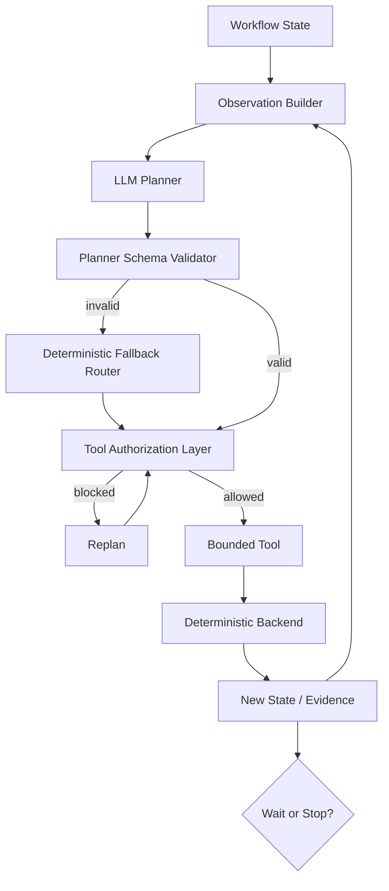
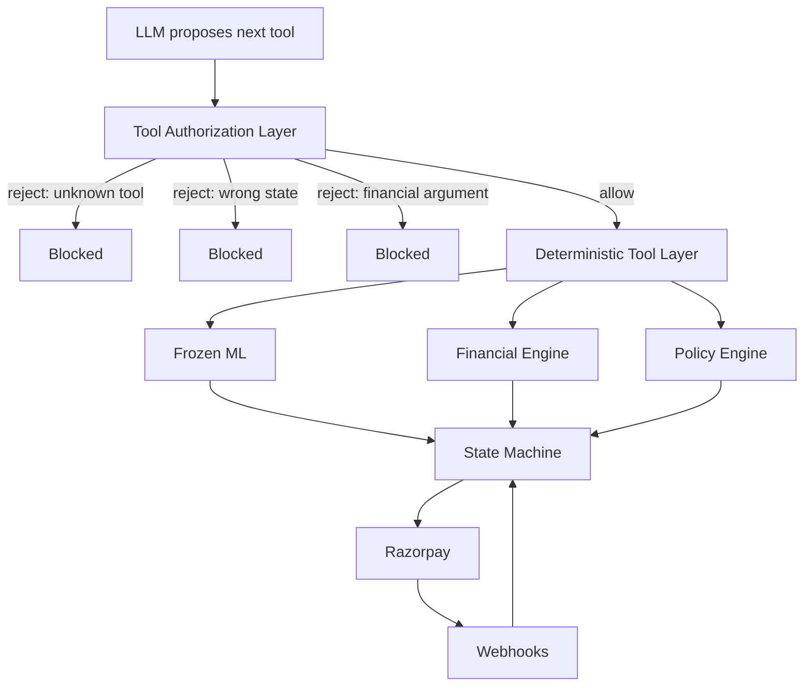

# Agent Architecture

## Safety layering

There is no edge from the LLM to Razorpay, to the financial engine, or to the
state machine. Every path passes through the authorization layer first.

## Three independent defences

1. **Schema** — `next_tool` is a `Literal`; unknown names fail parsing. Extra
   fields are forbidden, so a monetary override cannot ride alongside a valid
   tool.
2. **State gating** — a tool valid in one state is refused in another. The model
   is never trusted to respect the state machine.
3. **Argument screening** — any argument name resembling an amount, discount,
   probability, expected value, payment status, workflow state or policy
   override is rejected, on any tool.

## Budgets

`max_tool_calls=6`, `max_replans=3`, `max_diagnosis_calls=1`,
`max_analysis_calls_per_attempt=1`, `max_steps=12`. Exceeding any ends the run
as `STOPPED_BUDGET` with no financial action. A no-progress detector stops runs
where state, attempt, policy decision and evidence are all unchanged across
calls.