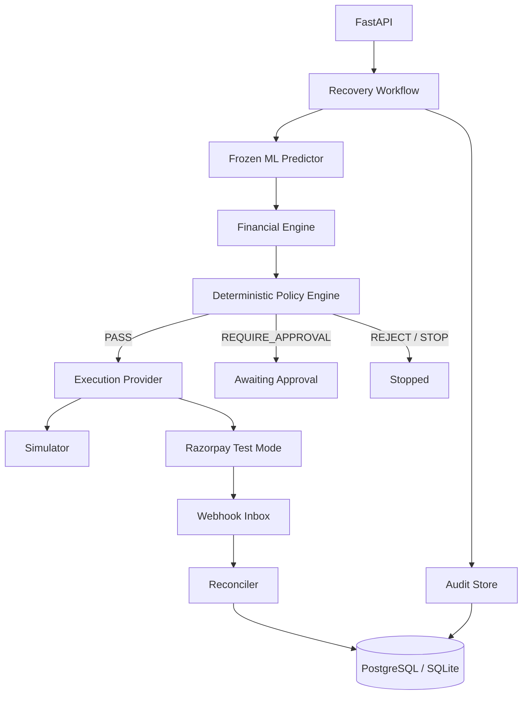
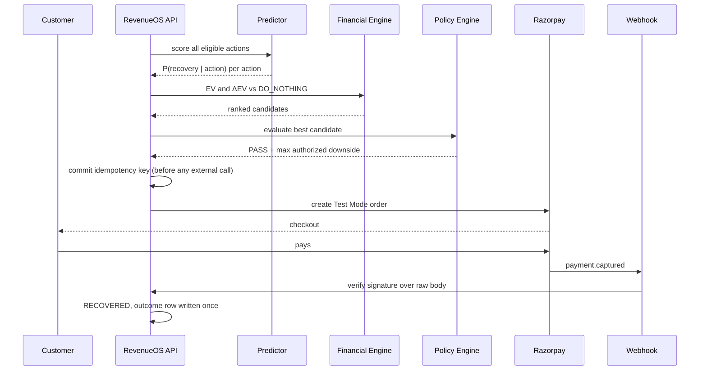
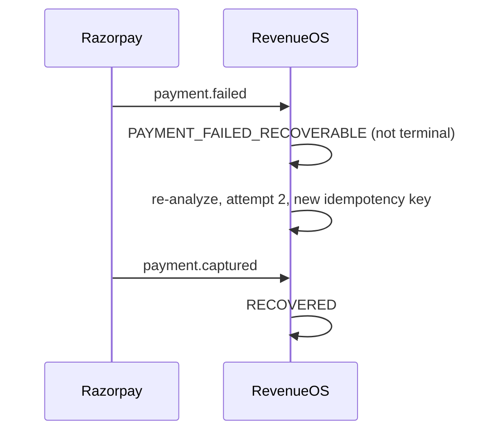
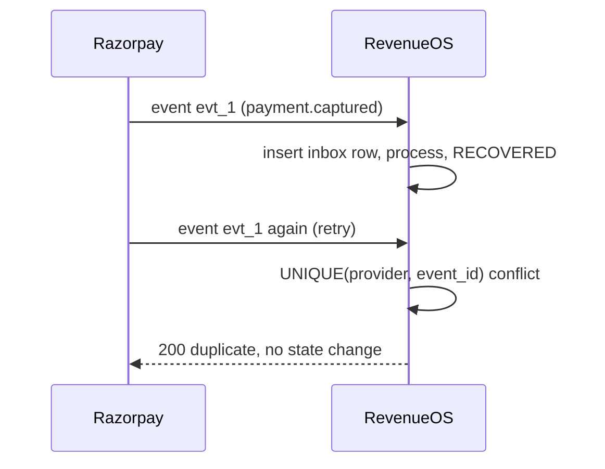

# RevenueOS — Backend Architecture (Phase 5/6)

## Authority chain

**ML predicts. Economics ranks. Policy authorizes. Razorpay executes. Webhooks
verify. Audit records.** No component assumes another's authority: the predictor
returns probabilities and nothing else, the financial engine takes no model, and
the policy engine takes no text.

## Successful recovery

## Failure then recovery

A failed payment is never treated as final: the same order may still be captured.

## Duplicate webhook

## Tables

`opportunities`, `action_predictions`, `action_financial_evaluations`,
`policy_evaluations`, `policy_rule_evaluations`, `recovery_executions`,
`recovery_outcomes`, `payment_failures`, `audit_events`, `webhook_inbox`.

Key constraints: `recovery_executions.idempotency_key` UNIQUE;
`webhook_inbox (provider, event_id)` UNIQUE; `audit_events (opportunity_id,
sequence_number)` UNIQUE; `recovery_outcomes.opportunity_id` PRIMARY KEY, which
is what makes double-counting structurally impossible.

## Research vs live metrics

`evaluation/results/` holds frozen research evaluation on held-out TEST data.
`/api/dashboard/metrics` reports only live and seeded execution outcomes and
labels itself `LIVE_OPERATIONAL`. These are different classes of evidence and
are never summed together.